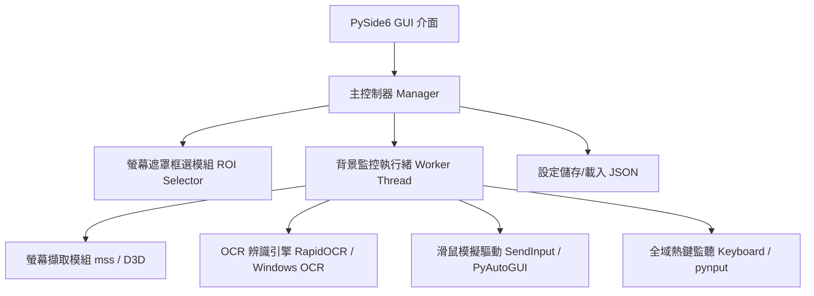
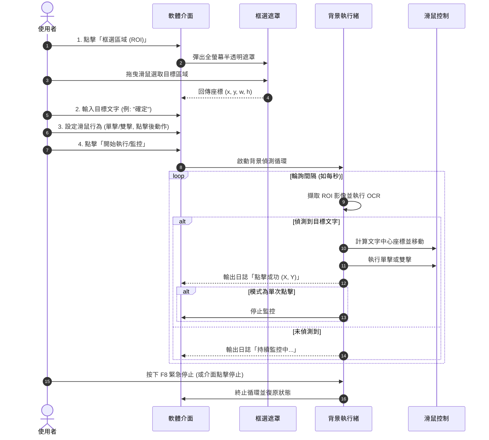

# 產品需求文件 (PRD) - 自動文字偵測點選工具 (AutoClicker by OCR)

---

## 1. 產品概述 (Overview)

### 1.1 背景與目的
在日常辦公、自動化測試或重複性作業中，許多傳統應用程式或網頁缺乏專用 API，使用者需要頻繁監看螢幕特定區域並手動點擊出現的文字按鈕（例如：「確定」、「送出」、「下一頁」、「領取」等）。
本軟體旨在提供一個輕量、直覺且可靠的 Windows PC 端桌面應用工具，允許使用者自訂螢幕感興趣區域 (Region of Interest, ROI)，即時或定時進行文字辨識 (OCR)，並在命中目標文字時自動將滑鼠游標移至該目標位置，執行單擊或雙擊操作。

### 1.2 產品價值
- **減少重複作業**：自動監控與點擊，釋放人力時間。
- **高自由度與彈性**：支援框選任意 ROI、調整偵測頻率與滑鼠行為。
- **直覺易用**：具備螢幕半透明框選遮罩（類似截圖工具），無需手動測量座標。
- **安全可控**：內建全域緊急停止快速鍵 (Kill Switch) 與偵測可視化回饋。

---

## 2. 目標使用者與使用情境 (User Personas & Scenarios)

### 2.1 目標使用者
- 需要長時間盯著特定系統等待彈出特定提示/按鈕並點擊的作業員或行政人員。
- 軟體測試工程師 (QA/SDET) 需要進行基礎黑箱 UI 自動化測試。
- 追求日常流程自動化的個人使用者。

### 2.2 典型使用情境
1. **情境 A（單次觸發）**：使用者框選畫面上一塊區域，輸入目標字詞「確認付款」，點擊「立即尋找並點擊」，系統識別後立刻移至該文字點擊一次。
2. **情境 B（持續監控）**：使用者框選特定視窗的右下角，設定每 2 秒輪詢一次。當畫面出現「重新連線」時，自動移動至該按鈕並雙擊，隨後停止或繼續監控。

---

## 3. 核心功能需求 (Functional Requirements)

### 3.1 模組一：自訂 ROI 區域選取 (Screen ROI Selection)
- **FR-1.1 視覺化螢幕框選**：
  - 提供「選取區域」按鈕，觸發後全螢幕覆蓋半透明遮罩（類似 Windows 截圖工具 Snipping Tool）。
  - 使用者透過滑鼠左鍵拖曳拉出矩形框，放開後自動儲存該區域的螢幕座標 $(X, Y, W, H)$。
  - 按下 `ESC` 鍵可取消框選。
- **FR-1.2 手動微調座標**：
  - 介面提供數值輸入框 ($X, Y, W, H$)，允許使用者精確微調或直接手動輸入座標。
- **FR-1.3 多螢幕與高 DPI 支援**：
  - 正確處理 Windows 顯示比例縮放 (100%, 125%, 150%, 200%)，確保框選區域與實際像素無偏移。
  - 支援跨螢幕或次螢幕上的區域選取。

### 3.2 模組二：文字偵測與辨識 (OCR & Text Detection)
- **FR-2.1 目標文字設定**：
  - 使用者可輸入一個或多個目標關鍵字（例如：「確定」或「OK」）。
  - 比對模式：
    - 完全匹配 (Exact Match)
    - 模糊/包含匹配 (Contains Match)
    - 正規表達式 (Regex Match，選用進階功能)
- **FR-2.2 OCR 辨識引擎**：
  - 支援繁體中文、簡體中文、英文及數字辨識。
  - 離線本地運算，不依賴外部網路雲端 API（保護隱私與即時性）。
  - 預計採用輕量且精準的 OCR 方案（如 RapidOCR / PaddleOCR 輕量模型或 Windows 原生 OCR）。
  - 提供辨識信心度門檻值設定（預設 0.6），過濾雜訊。
- **FR-2.3 座標定位計算**：
  - 當 OCR 成功辨識文字框，系統自動計算該文字框之中心點座標 $(X_{center}, Y_{center})$。
  - 支援「點擊偏移量」設定 $(\Delta X, \Delta Y)$，供特殊按鈕位置調整。

### 3.3 模組三：滑鼠動作與自動化控制 (Mouse Automation)
- **FR-3.1 點擊動作設定**：
  - 支援滑鼠左鍵：**單擊 (Single Click)** 或 **雙擊 (Double Click)**。
  - 可設定點擊前移動速度（瞬間瞬移 / 平滑擬人移動）。
  - 雙擊間隔時間設定（預設 150ms）。
- **FR-3.2 執行後行為**：
  - 成功點擊後：可選「停止監控」或「冷卻 N 秒後繼續監控」。
  - 點擊後是否將滑鼠復位（返回點擊前游標所在位置）。

### 3.4 模組四：排程與監控模式 (Execution & Loop Strategy)
- **FR-4.1 執行模式**：
  - **單次執行 (One-shot)**：掃描一次 ROI，找到即點擊，未找到則提示。
  - **循環監控 (Loop Monitoring)**：按設定之間隔時間（如 0.5s ~ 60s）重複掃描。
- **FR-4.2 全域緊急停止熱鍵 (Global Kill Switch)**：
  - 註冊系統全域快捷鍵（例如 `F8` 或 `Ctrl + Q`），無論目前焦點在哪個視窗，按下均能立即中止自動化腳本。
  - 支援滑鼠防呆邊界觸發（PyAutoGUI FailSafe，移到螢幕角落強制暫停）。

### 3.5 模組五：使用者介面與系統整合 (GUI & System Integration)
- **FR-5.1 現代桌面視窗**：
  - 清晰分區：ROI 設定區、目標文字設定區、滑鼠動作設定區、執行控制區、日誌紀錄區。
  - 即時日誌 (Log Viewer)：顯示當前狀態、OCR 辨識耗時、偵測到的文字內容、點擊座標。
  - 預覽視窗 (ROI Preview)：顯示目前框選區域之縮圖，方便確認。
- **FR-5.2 設定檔儲存與載入**：
  - 支援將 ROI 座標、關鍵字、動作設定儲存為範本 (JSON 設定檔)。
  - 下次啟動可快速載入歷史設定。

---

## 4. 非功能需求 (Non-Functional Requirements)

| 維度 | 規格要求 |
| :--- | :--- |
| **作業系統** | Windows 10 / Windows 11 (64-bit) |
| **辨識效能** | ROI 截圖與 OCR 辨識單次耗時 $\le$ 300ms（一般解析度 ROI 範圍） |
| **資源消耗** | 待機或輪詢時 CPU 使用率 $\le$ 5%，記憶體佔用 $\le$ 250MB |
| **穩定性與安全** | 執行背景執行緒 (QThread/Worker) 避免介面凍結；具備全域熱鍵中斷保障使用者能隨時奪回滑鼠控制權 |
| **封裝交付** | 支援純 Python 執行環境及 PyInstaller 單一可執行檔 (.exe) 免安裝綠色部署 |

---

## 5. 技術架構與模組劃分 (Technical Architecture)

### 5.1 推薦技術棧 (Recommended Tech Stack)
- **GUI 框架**：Python + **PySide6** (Qt 官方庫，支援高 DPI 縮放、半透明遮罩視窗、現代化 UI 樣式)
- **螢幕截圖**：`mss` 或 `PySide6.QScreen`（極高速截取螢幕特定區域）
- **文字辨識 (OCR)**：`rapidocr_onnxruntime`（跨平台、輕量免配環境、離線且辨識中英繁體準確度極高）
- **滑鼠與鍵盤控制**：`pynput` 或 `pyautogui` + Win32 API (`SendInput` 保證相容性)
- **全域熱鍵**：`keyboard` 或 Qt 原生 Windows 熱鍵鉤子

---

## 6. 使用者操作流程 (User Flow)

---

## 7. 開發階段與里程碑 (Milestones)

- **Phase 1: 核心功能驗證 (PoC)**
  - 驗證 ROI 截圖、RapidOCR 辨識中文字準確度、滑鼠移動與單/雙擊模擬。
- **Phase 2: GUI 介面與互動 (UI Implementation)**
  - 完成 PySide6 主視窗、全螢幕半透明框選遮罩、即時預覽圖、日誌區。
- **Phase 3: 背景執行緒與安全機制 (Integration & Safety)**
  - 實作 QThread 非同步偵測避免 UI 卡頓。
  - 整合 F8 全域熱鍵與防呆機制。
  - 加入設定檔 (config.json) 儲存/載入功能。
- **Phase 4: 測試與優化 (Testing & Packaging)**
  - 測試多種解析度與 DPI 縮放下的座標命中率。
  - 測試遊戲/辦公軟體/瀏覽器視窗點擊效果。
  - 使用 PyInstaller 封裝為獨立 .exe 檔。
