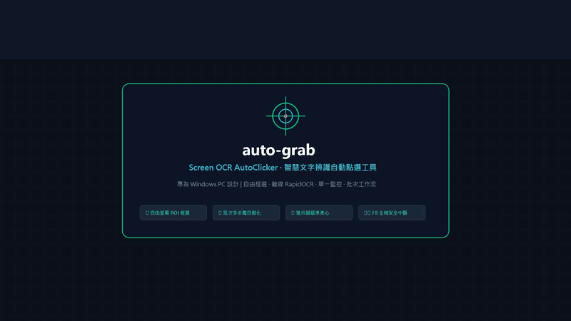

# 自動文字偵測點選工具 (Screen OCR AutoClicker / auto-grab)

> 🌐 **線上即時展示看板 (Live Demo Showcase)**：[https://feynmanwen.github.io/auto-grab/](https://feynmanwen.github.io/auto-grab/)  
> 🎬 **操作示範影片 (1080p MP4)**：[docs/demo.mp4](docs/demo.mp4)

---

## 🎬 系統操作與使用示範 (Demo Preview)



> 💡 **示範流程包含**：
> 1. **自由框選 ROI**：全螢幕半透明遮罩拖曳選取目標按鈕，座標尺寸即刻自動同步。
> 2. **設定關鍵字與準心**：輸入目標文字，右側即時呈現高對比度瞄準準心與螢幕物理座標。
> 3. **高速離線辨識與自動點選**：RapidOCR 26ms 毫秒級定位文字，滑鼠平滑移動並自動執行點擊。
> 4. **批次多步驟自動化工作流**：依序執行登入、同意條款、送出申請之多步驟連續流程。
> 5. **全域安全防護**：F8 瞬間緊急停止與 (0, 0) 邊界角落防呆機制。

---

這是一款專為 Windows PC 設計的自動文字辨識與滑鼠點擊工具。支援**「單一區域模式」**與全新**「批次多步驟模式」**。允許使用者自由框選螢幕上的感興趣區域 (ROI)，利用本機離線 RapidOCR 引擎即時辨識目標文字，並在文字出現時自動將滑鼠游標精準移至文字中心，執行左鍵單擊或雙擊。

---

## 🌟 核心特色

### 1. 雙模式架構 (Single & Batch Modes)
- **📍 單一區域模式**：
  - 自由框選單一畫面區域進行持續輪詢監控。
  - 調整 X, Y, W, H 或點擊偏移座標時，預覽區**即時更新畫面並顯示雙層高對比度瞄準準心**，讓您直覺確認點擊落點。
  - 命中文字後預設冷卻數秒（如 3 秒）繼續監控，亦可切換為單次執行。
- **⚡ 批次多步驟模式 (工作流序列)**：
  - 支援順序建立多個步驟（例如：「步驟 1: 點擊確認」 $\rightarrow$ 「步驟 2: 點擊下一步」 $\rightarrow$ 「步驟 3: 點擊完成」）。
  - 每個步驟擁有**獨立的專屬 ROI 區域**、**目標文字關鍵字**、**滑鼠動作（單擊/雙擊）**、**點擊後延遲秒數**與**等待超時上限**。
  - 執行時依序推進，畫面表格自動高亮當前執行步驟，預覽區同步切換為該步驟的畫面。
  - 支援「整批完成後持續循環重跑」開關與冷卻時間設定。

### 2. 即時高對比度瞄準準心 (Crosshair Reticle)
- 在右側預覽畫面中繪製雙層同心圓與延伸十字準心，在深色或淺色視窗背景上皆清晰可見。
- 顯示預計點擊的螢幕絕對實體座標 $(X, Y)$，座標調整毫無死角。

### 3. 本地離線 RapidOCR 高精度辨識
- 採用 ONNX 輕量模型，免連外網、保護隱私且效能極高（單次辨識約 50~150ms）。
- 支援繁簡體中文、英文及數字辨識，提供「包含關鍵字」(模糊比對) 與「完全一致」(精確比對)。

### 4. 系統級安全中斷 (Kill Switch)
- **全域快捷鍵**：任何時候按下鍵盤 **`F8`** 鍵，無論滑鼠目前在哪個視窗，皆能瞬間安全終止監控。
- **邊界防呆機制**：將滑鼠游標猛甩至螢幕左上角 (0, 0) 即可觸發 PyAutoGUI FailSafe 中斷。

---

## 🚀 快速啟動

### 方式一：直接雙擊批次檔（最簡單）
直接雙擊專案目錄下的 **`run.bat`** 即可啟動！

### 方式二：命令列啟動
```powershell
cd c:\Users\feynman\Desktop\AIA\Project\自動點選
.\.venv\Scripts\python.exe main.py
```

---

## 📖 批次模式操作指南

1. 切換至 **「⚡ 批次多步驟模式」** 分頁。
2. 點擊 **「➕ 新增步驟」**：
   - 輸入步驟名稱（例：`點擊登入按鈕`）。
   - 點擊「📐 立即框選螢幕區域」，在螢幕上拉框劃定該步驟的 ROI 範圍。
   - 輸入目標文字（例：`登入`）。
   - 設定滑鼠動作（單擊或雙擊）與點擊後延遲秒數（例如 `1.5` 秒）。
   - 點擊「確認儲存」。
3. 依序新增後續步驟（步驟 2、步驟 3...），可透過工具列的「⬆️ 上移」或「⬇️ 下移」隨時調整執行順序。
4. 點擊表格中的任一步驟，右側預覽區會即時顯示該步驟的畫面與瞄準準心。
5. 點擊 **「▶ 開始執行批次工作流 (F8)」**，軟體將自動依序偵測並點擊每個步驟！
6. 隨時按下鍵盤 **`F8`** 即可立即終止批次流程。
